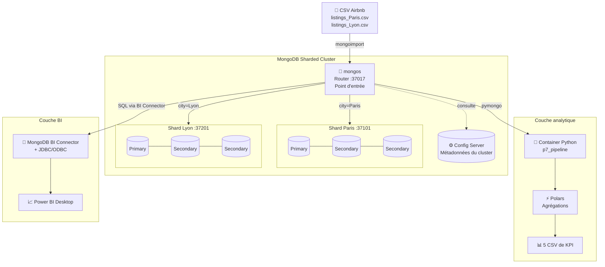

<div align="center">

# 🗄️🌍 NosCités — MongoDB Sharded Cluster

### Architecture NoSQL distribuée multi-sites pour l'observation des plateformes de location courte durée (Paris & Lyon)

[](https://www.python.org/)
[](https://www.mongodb.com/)
[](https://pola.rs/)
[](https://www.docker.com/)
[](https://powerbi.microsoft.com/)
[](LICENSE)

**[Contexte](#-contexte-business)** • **[Architecture](#%EF%B8%8F-architecture)** • **[Stack](#%EF%B8%8F-stack-technique)** • **[Démarrage](#-démarrage-rapide)** • **[Sharding](#-sharding-multi-sites)** • **[Résultats](#-résultats-clés)**

</div>

---

## 📋 Contexte business

**Association NosCités** — observatoire indépendant des plateformes de location courte durée (Airbnb, Booking, etc.). Présente à Paris et Lyon, l'association mesure l'impact de ces plateformes sur l'offre de logements longue durée et apporte de la **transparence** dans le débat public.

L'association a fait le choix de **ne pas héberger ses données chez un fournisseur cloud** : ses serveurs sont à Paris et à Lyon, pour garantir l'indépendance et la confidentialité de ses analyses. Cela implique une architecture distribuée multi-sites avec des contraintes fortes de **résilience**, de **routage géographique des données** et de **performance des requêtes locales**.

> 🚨 **Scénario de crise initial** : suite à un crash total de la base de données Paris (par négligence ou attaque malveillante), il a fallu **restaurer la base**, **analyser son intégrité** par série de requêtes, puis **concevoir une nouvelle architecture pérenne** capable de prévenir ce type d'incident — le tout dans un contexte d'urgence : produire un rapport sur l'effet **"JO 2024"** sur l'offre de logements parisienne.

---

## 🎯 Objectifs

- ✅ **Restaurer** une base MongoDB depuis une sauvegarde et valider son intégrité
- ✅ **Concevoir 11 requêtes analytiques** métier sur ~96 000 logements (CLI MongoDB + Polars)
- ✅ Mettre en place une **stratégie de réplication** (ReplicaSet 3 nodes) pour la haute disponibilité
- ✅ Mettre en place une **stratégie de sharding** avec **zone sharding** pour distribuer géographiquement Paris/Lyon
- ✅ Exposer les données via **Power BI** pour permettre aux équipes d'analyse de continuer leur travail
- ✅ Conteneuriser l'environnement Python d'analyse pour la **reproductibilité**

---

## 🏗️ Architecture



**Trois couches indépendantes** :

1. **Couche stockage distribué** : cluster MongoDB shardé avec routage géographique
2. **Couche analytique** : container Docker Python (Polars + pymongo) pour le calcul de KPI
3. **Couche BI** : Power BI via MongoDB BI Connector pour les analystes métier

---

## 🛠️ Stack technique

| Composant | Technologie | Version | Rôle |
|-----------|-------------|---------|------|
| **Base NoSQL** | MongoDB | `7.0.25` | Stockage distribué orienté documents |
| **Shell Mongo** | mongosh | `2.5.10` | Admin cluster, requêtes CLI |
| **Driver Python** | pymongo | — | Connexion depuis les scripts |
| **Analyse** | **Polars** | — | Requêtes analytiques complexes (group by, ranking, fenêtrage) |
| **Conteneurisation** | Docker + Docker Compose | — | Isolation environnement Python |
| **GUI Mongo** | MongoDB Compass | — | Inspection schema + dev |
| **BI** | Power BI Desktop | — | Dashboards métier |
| **Connecteur BI** | MongoDB BI Connector | — | Pont SQL ↔ MongoDB via JDBC/ODBC |

---

## 📊 Dataset

**Source** : Données publiques Airbnb (snapshot juin 2024) — fichiers CSV `listings_Paris.csv` et `listings_Lyon.csv`.

| Caractéristique | Valeur |
|-----------------|--------|
| Documents Paris | **95 885** |
| Documents Lyon | **9 973** *(après normalisation du champ `city`)* |
| **Total cluster** | **105 858 documents** |
| Volume sur disque | ~362 MiB |
| Champs par document | ~70 (logement, hôte, disponibilités, évaluations) |
| Base | `P7MLO` |
| Collection | `listings` |

---

## 🚀 Démarrage rapide

### Prérequis

- Linux/macOS (testé sur Ubuntu) — `mongod`, `mongos` et `mongosh` installés
- Docker + Docker Compose
- Python 3.11+ (si exécution hors container)
- ~1 Go de RAM disponible pour le cluster MongoDB

### 1. Mise en route du cluster shardé

Les commandes ci-dessous résument la procédure de déploiement local du cluster (utilisée pour la conception du projet) :

```bash
# Config server (port 37017 pour mongos)
mongod --configsvr --replSet configReplSet --port 37119 --dbpath /var/lib/mongo/cfg

# Shard Paris (ReplicaSet, port 37101)
mongod --shardsvr --replSet shardParis --port 37101 --dbpath /var/lib/mongo/shardParis
# (+ 2 nodes secondaires sur ports différents pour le ReplicaSet)

# Shard Lyon (ReplicaSet, port 37201)
mongod --shardsvr --replSet shardLyon --port 37201 --dbpath /var/lib/mongo/shardLyon
# (+ 2 nodes secondaires sur ports différents pour le ReplicaSet)

# Router mongos (point d'entrée client)
mongos --configdb configReplSet/localhost:37119 --port 37017

# Ajout des shards au cluster
mongosh --port 37017 --eval '
  sh.addShard("shardParis/localhost:37101");
  sh.addShard("shardLyon/localhost:37201");
'
```

### 2. Activation du sharding sur la collection

```javascript
// Depuis mongosh connecté à mongos (port 37017)
sh.enableSharding("P7MLO")

// Création de la clé de sharding compound
sh.shardCollection("P7MLO.listings", { city: 1, id: 1 })

// Zone sharding : assignation des plages aux shards
sh.addShardTag("shardParis", "PARIS")
sh.addShardTag("shardLyon", "LYON")
sh.addTagRange(
  "P7MLO.listings",
  { city: "Paris", id: MinKey }, { city: "Paris", id: MaxKey },
  "PARIS"
)
sh.addTagRange(
  "P7MLO.listings",
  { city: "Lyon", id: MinKey }, { city: "Lyon", id: MaxKey },
  "LYON"
)
```

### 3. Import des données

```bash
mongoimport \
  --uri "mongodb://admin@localhost:27017/P7MLO?authSource=admin" \
  --collection listings \
  --type csv --headerline \
  --file listings_Paris.csv
```

### 4. Lancement de l'analyse Polars (via Docker)

```bash
# Le pipeline Python s'exécute dans un container avec network_mode: host
# pour pouvoir joindre le mongos sur localhost:37017
docker compose up --build
```

Les **5 fichiers CSV de KPI** sont produits dans `./outputs/`.

### 5. Validation

```javascript
// Depuis mongosh sur mongos
sh.status()
db.listings.getShardDistribution()
db.listings.find({ city: "Paris" }).explain()   // doit ne cibler que shardParis
```

---

## 📁 Structure du projet

```
Nosql-database-design/
├── docker-compose.yml            # Lancement du container Python
├── Docker/
│   └── Pipeline/
│       ├── Dockerfile            # Image Python 3.11 + polars + pymongo
│       └── requirements.txt
├── Requetes/
│   ├── requetes_P7_1.py          # Partie 1 — Restauration & validation
│   ├── requetes_P7_2.py          # Partie 2 — 5 KPI analytiques (Polars)
│   └── requetes_P7_3.py          # Partie 3 — Setup sharding & ReplicaSet
├── Data/                         # Données sources (non versionnées)
├── outputs/                      # Résultats des requêtes (CSV)
├── .env                          # Variables d'env (non versionné)
└── README.md
```

---

## 🧠 Choix de conception

### 1. Compound shard key `{city: 1, id: 1}`

| Composant | Rôle |
|-----------|------|
| `city` (prefix) | **Routage géographique** — toute requête filtrant par `city` est locale au shard correspondant (pas de scatter-gather, pas de cross-shard query) |
| `id` (suffix) | **Haute cardinalité** — garantit une bonne distribution des chunks à l'intérieur de chaque zone et évite les hot spots |

> 💡 **Pourquoi pas juste `{city: 1}`** ? La cardinalité de `city` est extrêmement faible (2 valeurs : Paris, Lyon). MongoDB n'aurait pas pu découper équitablement les chunks → un seul *jumbo chunk* par ville → impossible de scaler horizontalement à l'intérieur d'une ville. La compound key avec `id` résout ce problème.

### 2. Zone sharding Paris ↔ Lyon

Au-delà du sharding "classique", on a explicitement assigné les **plages de valeurs `city`** à des shards précis via `sh.addTagRange()`. Cela garantit la **résidence des données par localité** — exigence métier directe du projet (chaque équipe locale accède rapidement à ses propres données, conformité au choix d'indépendance de NosCités).

### 3. ReplicaSet 3 nodes par shard

Chaque shard est un **ReplicaSet de 3 nodes** (1 primary + 2 secondaries). Justification :

- ✅ Tolérance à une panne complète d'un node sans perte de service
- ✅ Élection automatique d'un nouveau primary en cas de défaillance
- ✅ Possibilité de servir des requêtes en lecture sur les secondaries (déchargement du primary)

### 4. MongoDB tourne nativement, le container ne sert que pour Python

Choix architectural assumé du `docker-compose.yml` :

```yaml
services:
  pipeline:
    build: ./Docker/Pipeline
    container_name: p7_pipeline
    network_mode: host                    # ← accès direct aux ports mongo
    volumes:
      - ./Requetes:/app/Requetes:ro       # ← code en lecture seule
      - ./outputs:/app/outputs            # ← export des résultats
```

- ✅ MongoDB et ses processus (`mongod`, `mongos`) tournent **directement sur l'hôte** pour pouvoir manipuler ReplicaSet et Sharding de façon réaliste (multi-ports, multi-processus)
- ✅ **Seul l'environnement Python** est containerisé → reproductibilité des requêtes analytiques sans dépendre de l'installation locale
- ✅ `network_mode: host` permet au container de joindre `localhost:37017` (le mongos) sans abstraction réseau
- ✅ `Requetes/` monté en **read-only** → impossible pour le container de modifier le code

### 5. Polars plutôt que pandas

Pour les requêtes complexes (ranking par fenêtre, group-by multi-colonnes), **Polars** est utilisé à la place de pandas :

```python
df.group_by(["mois", "neighbourhood_cleansed"])
  .agg(pl.col("taux_reservation_30j").mean().alias("taux_reservation_moyen"))
  .with_columns(
      pl.col("taux_reservation_moyen")
        .rank(method="dense", descending=True)
        .over("mois")
        .alias("rang")
  )
  .filter(pl.col("rang") <= TOP_N)
```

→ Performances supérieures sur gros volumes, API plus expressive (window functions natives), exécution lazy.

### 6. Configuration externalisée via variables d'environnement

Le script Python accepte ses paramètres de connexion via `os.getenv` :

```python
MONGO_URI = os.getenv("MONGO_URI", "").strip()
MONGO_HOST = os.getenv("MONGO_HOST", "localhost").strip()
MONGO_PORT = os.getenv("MONGO_PORT", "27017").strip()
MONGO_USER = os.getenv("MONGO_USER", "").strip()
MONGO_PASS = os.getenv("MONGO_PASS", "").strip()
OUTDIR = os.getenv("OUTDIR", "/app/outputs")
TOP_N = int(os.getenv("TOP_N", "5"))
```

→ Pas de credentials hardcodés. Aligne avec les bonnes pratiques 12-factor app.

---

## 🌐 Sharding multi-sites

### Distribution effective mesurée

Après import via `mongos` et application des zones, la répartition observée :

| Shard | Documents | Volume | Chunks | % cluster |
|-------|-----------|--------|--------|-----------|
| **shardParis** | 95 885 | 328.4 MiB | 1 | **90.57%** |
| **shardLyon** | 9 973 | 33.26 MiB | 4 | **9.42%** |
| **Total** | **105 858** | **361.67 MiB** | **5** | 100% |

→ Distribution conforme à la **volumétrie réelle** du marché (Paris >> Lyon). La répartition asymétrique est **acceptée et assumée** : elle reflète la réalité métier, ce qui est le bon comportement d'une stratégie multi-sites bien conçue.

### Validation

Les commandes utilisées pour valider le bon routage des requêtes :

```javascript
sh.status()                                              // Vue d'ensemble du cluster
db.listings.getShardDistribution()                       // Distribution par shard
db.listings.find({ city: "Paris" }).explain()            // Doit cibler UNIQUEMENT shardParis
db.listings.find({ city: "Lyon" }).explain()             // Doit cibler UNIQUEMENT shardLyon
```

---

## 📈 Résultats clés

### Vue d'ensemble du marché parisien (snapshot juin 2024)

| KPI | Valeur |
|-----|--------|
| Annonces totales | 95 885 |
| **Hôtes distincts** | **71 979** |
| Logements réservables instantanément | 22 094 (**23%**) |
| **Super hôtes** | 10 027 (**13.93%**) |
| Hôtes "professionnels" (>100 annonces) | 22 (0.03%) |

### Répartition par type de location

| Type | Nombre d'annonces |
|------|------------------|
| Logement entier | **85 733** (89%) |
| Chambre privée | 8 975 (9%) |
| Chambre d'hôtel | 776 |
| Chambre partagée | 401 |

### Insight métier fort — Effet "super hôte"

| Catégorie | Médiane du nombre d'avis |
|-----------|--------------------------|
| Superhôte | **24** |
| Non superhôte | **2** |

→ **Gap × 12** : les Superhôtes captent une part disproportionnée des locations effectives. C'est un indicateur fort de **professionnalisation** du marché.

### Top 5 quartiers parisiens — taux de réservation (juin 2024)

| Rang | Quartier | Taux de réservation |
|------|----------|---------------------|
| 1 | Ménilmontant | 75.42% |
| 2 | Entrepôt | 74.81% |
| 3 | Popincourt | 74.78% |
| 4 | Buttes-Chaumont | 74.13% |
| 5 | Panthéon | 73.14% |

### Top 5 quartiers — densité d'annonces

| Rang | Quartier | Nombre d'annonces |
|------|----------|-------------------|
| 1 | Buttes-Montmartre | 10 555 |
| 2 | Popincourt | 8 430 |
| 3 | Vaugirard | 7 802 |
| 4 | Batignolles-Monceau | 6 857 |
| 5 | Entrepôt | 6 558 |

---

## 📊 Connexion Power BI

Power BI Desktop est connecté au cluster via la chaîne :

```
Power BI → MongoDB BI Connector → JDBC/ODBC Driver → mongos (MongoDB)
```

Cette architecture permet aux **analystes métier** de continuer à utiliser leur outil habituel (SQL via Power BI) **sans connaître MongoDB**, tout en bénéficiant des avantages du cluster distribué (résilience, scalabilité, routage géographique). C'est l'incarnation du principe **"séparation des préoccupations"** : les data engineers gèrent l'infra, les analystes consomment.

---

## 🌱 Aller plus loin (V2)

Pistes d'amélioration identifiées pour une version production :

- 🔐 **Authentification stricte sur le cluster** : keyfile + TLS entre les nodes du ReplicaSet
- 📅 **Snapshots automatisés** des shards via `mongodump` planifié
- 📈 **Monitoring** via MongoDB Ops Manager ou Percona PMM
- 🔄 **Pipeline d'ingestion idempotent** (upsert sur clé métier `id`) — déjà identifié dans le logigramme méthodologique
- 🌍 **Ajout d'autres villes** (Marseille, Bordeaux, Nice) → ajouter une nouvelle zone sharding
- ⏱️ **Données temporelles** : suivre l'évolution mensuelle du marché plutôt qu'un snapshot
- 🔍 **Index composés** orientés requêtes BI (sur `(city, room_type, last_scraped)` par exemple)

---

## 📂 Documents complémentaires

- 📄 [`P7_Support_de_presentation.pdf`](./P7_Support_de_presentation.pdf) — Présentation de soutenance (architecture, choix techniques, résultats)
- 📊 `outputs/*.csv` — Résultats des 5 requêtes analytiques

---

## 👤 Auteur

**Mathieu Lowagie**  
Data Engineer | Service Delivery Manager — 17 ans d'expérience B2B télécoms

🔗 [LinkedIn](https://www.linkedin.com/in/mathieulowagie/) • 💼 [GitHub](https://github.com/Melkia44)

---

## 📄 Licence

Projet réalisé dans le cadre du **Master 2 Data Engineering** (OpenClassrooms — Projet 7 *"Concevez et analysez une base de données NoSQL"*).

Distribué sous licence **MIT** — voir [LICENSE](LICENSE) pour les détails.
